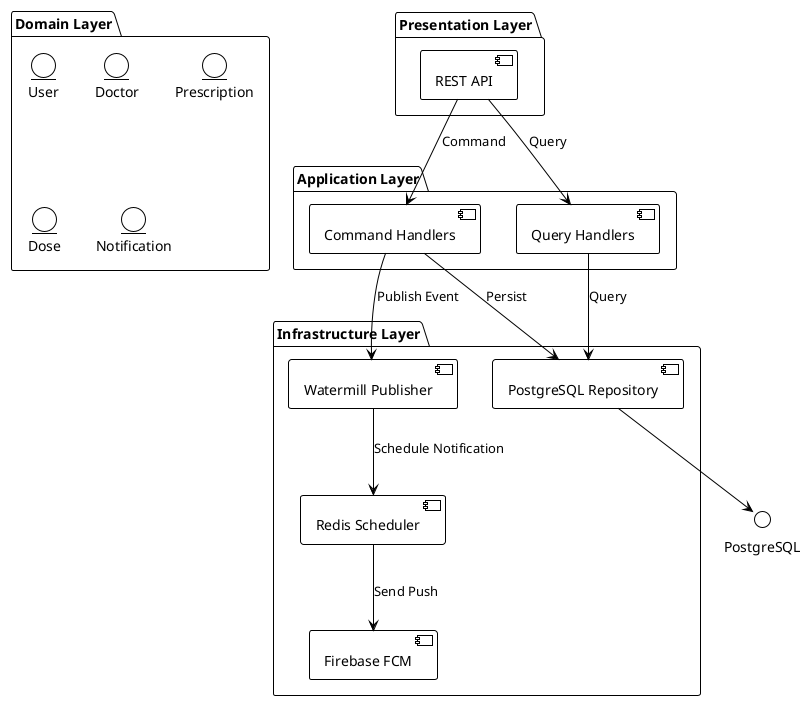
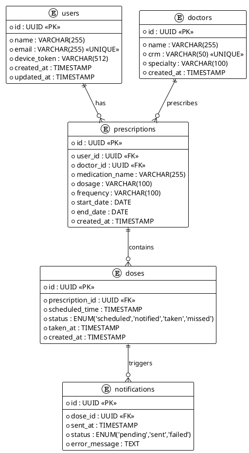
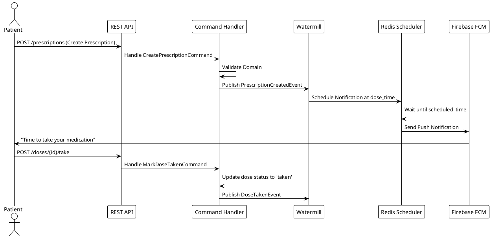
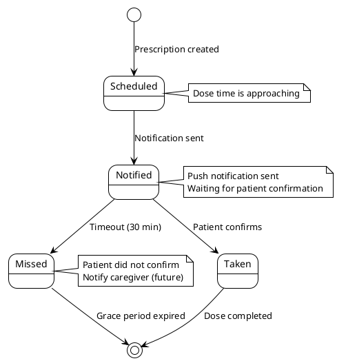
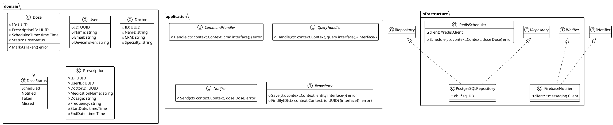

# MedNotify - Requisitos e Documentação Técnica

## 1. Visão Geral do Sistema

MedNotify é uma plataforma de notificação de medicamentos projetada para ajudar pacientes a gerenciar sua medicação de forma segura e pontual. O sistema combina uma API REST, messaging event-driven com Watermill, agendamento via Redis e notificações push via Firebase FCM.

**Stack Tecnológico:**
- Go 1.25+
- Watermill (event streaming)
- Redis (agendamento de notificações)
- PostgreSQL (persistência)
- Firebase FCM (push notifications)
- Clean Architecture + CQRS

---

## 2. Diagrama de Arquitetura (PlantUML)

---

## 3. Diagrama de Entidade-Relacionamento (PlantUML)

---

## 4. Diagrama de Sequência - Fluxo de Notificação (PlantUML)

---

## 5. Diagrama de Estados - Ciclo de Vida da Dose (PlantUML)

---

## 6. Diagrama de Classes - Clean Architecture (PlantUML)

---

## 7. Marcação de Requisitos

| ID | Requisito | Status |
|----|-----------|--------|
| REQ-001 | API REST para CRUD de usuários | `implementado` |
| REQ-002 | API REST para CRUD de médicos | `implementado` |
| REQ-003 | API REST para CRUD de prescrições | `implementado` |
| REQ-004 | Eventos Watermill para domain events | `implementado` |
| REQ-005 | Agendamento Redis para notificações | `implementado` |
| REQ-006 | Integração Firebase FCM para push | `implementado` |
| REQ-007 | Padrão CQRS (Command/Query separation) | `implementado` |
| REQ-008 | Clean Architecture (domain/application/infrastructure) | `implementado` |
| REQ-009 | Testes unitários com cobertura > 70% | `não implementado` |
| REQ-010 | Testes de integração com build tag `integration` | `não implementado` |
| REQ-011 | Documentação PlantUML (este arquivo) | `implementado` |
| REQ-012 | LGPD Privacy by Design (minimização de dados) | `não documentado` |
| REQ-013 | Interface mobile para confirmação de dose | `fora de escopo (frontend)` |

---

## 8. Limites de Escopo

- **Frontend (Mobile/Web):** Fora de escopo para este projeto backend
- **Analytics/Relatórios:** Não escopo atual
- **Multi-idioma:** Não aplicável (projeto brasileiro)
- **Offline-first:** Não aplicável (sistema cloud)

---

## 9. Próximos Passos (Action Items)

- [ ] Implementar testes unitários (REQ-009)
- [ ] Implementar testes de integração (REQ-010)
- [ ] Documentar conformidade LGPD (REQ-012)

---

## 10. Status da Entrega

| Critério de Aceitação | Status |
|-----------------------|--------|
| Documento único em /docs | ✅ Concluído |
| Requisitos Funcionais e Não-Funcionais | ✅ Seção 7 |
| Diagrama de Classes | ✅ Seção 6 |
| Diagrama ER | ✅ Seção 3 |
| Diagrama de Sequência | ✅ Seção 4 |
| Diagrama de Estados | ✅ Seção 5 |
| Diagrama de Arquitetura (solution-level) | ✅ Seção 2 |
| Requisitos marcados (implementado/não impl./não doc./fora de escopo) | ✅ Seção 7 |
| PR para remote repo | ⚠️ Bloqueado — workspace sem git history |

**Aguardando:** Inicialização do repositório git para viabilizar PR aos artefatos de documentação.

---

*Documento gerado em: 2026-05-10*
*Versão: 1.1*